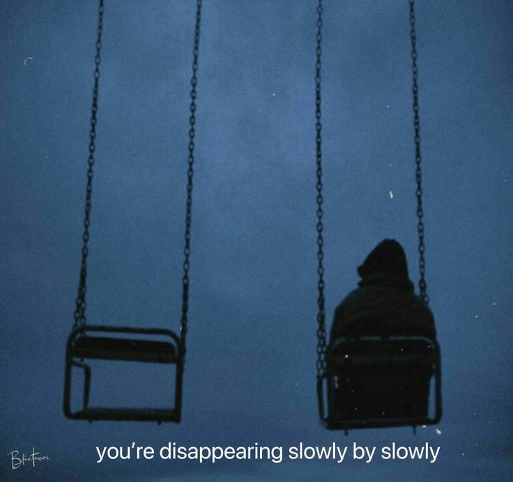

# Project: "I'M SORRY, GOD'S CALLING ME"

## Concept Overview

“I'M SORRY, GOD'S CALLING ME” explores the tension between earthly distractions and spiritual calling. This project encapsulates the struggle of maintaining focus amidst the noise of everyday life. The imagery portrays a man and a woman at a crossroads, symbolizing the choices we face when divine messages beckon us, yet worldly distractions pull us away.

### Themes:
- **Distraction vs. Purpose**: The girl represents distractions—physical and emotional—while Khadka embodies the pursuit of spiritual clarity.
- **Isolation and Connection**: The settings illustrate a sense of isolation in the search for connection, whether in a vast field or a crowded train station.
- **Divine Communication**: The vintage phone signifies a call from God, suggesting that clarity can emerge amidst confusion.

## 1. Setting Choices
- **Field**: 
  - Description: A wide-open space with tall grass or wildflowers, symbolizing freedom and distraction. 
  - Mood: Dark, moody sky to enhance the atmosphere.
  - 

- **Train Station**: 
  - Description: A structured environment conveying waiting and transitions. 
  - Mood: Dim lighting for intimacy and isolation.
  - 

## 2. Subjects
- **Girl**:
  - **Attire**: Classy, modest, fitted dress (black or white).
  - **Accessories**: 
    - Black heels
    - Holding flowers in one hand
    - Cigarette in the other
  - **Expression**: Mix of annoyance and longing, emphasizing distraction.
  - 

- **Khadka**:
  - **Attire**: Classy suit (black or dark grey) with a contrasting cravat.
  - **Pose**: Slightly turned away, looking up or to the side as if engaged in conversation.
  - 

## 3. Phone Element
- **Design**: Vintage phone hanging from the sky with a thin, glowing cable.
  - 
    - 

- **Spotlight**: Strong, focused beam illuminating the phone, suggesting divine communication.
  - 

## 4. Composition
- **Framing**: 
  - Girl positioned on the left, angled towards the viewer.
  - Khadka on the right, body language showing engagement with the phone.
  - 

- **Cropping**: Emphasize the phone coming from above to create separation.

## 5. Lighting
- **Mood**: Soft, diffused lighting for subjects; high contrast for the spotlight on the phone.
  - 

- **Shadows**: Enhance isolation feel.

## Additional Ideas
- **Symbolic Elements**: Incorporate subtle background details (distant figures, nature) suggesting distractions in life.

- **Color Palette**: Stick to black, white, blue, and green; consider slight tint or overlay hinting at singles' themes.
  - 

## Equipment
- **Camera**: DSLR or mirrorless for low-light photography.

- **Lighting**: 
  - Softboxes or LED panels for even lighting
  - Strong spotlight for phone.

- **Props**: 
  - Vintage phone
  - Flowers
  - Cigarette prop for authenticity.

- **Camera Stand**: Ensure stability for shots.

## INSPO

  - 
  - 

